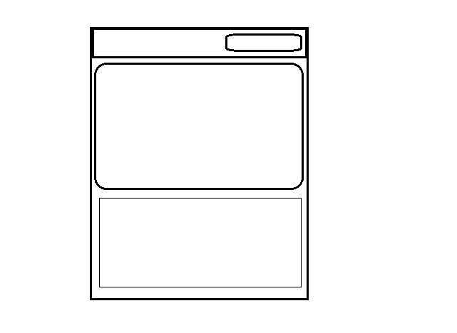
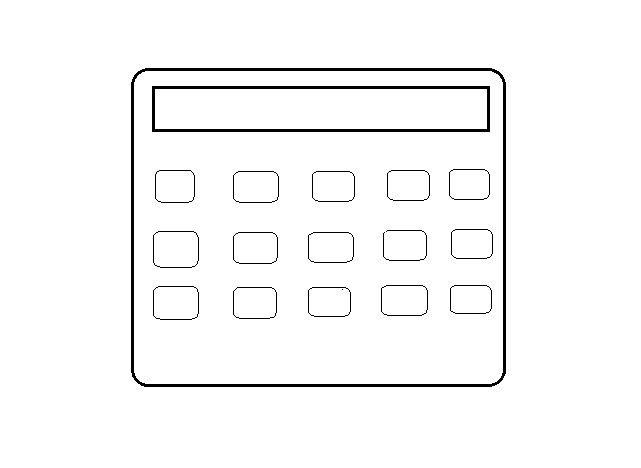

## My Bible Application

Clients story:
* as a client on this website, when you launch the webpage you would see an image that changes<br> anytime the page is reloaded and a daily bible quote that  changes every 24hrs, you would<br> see button on the top right corner of the page that says "Open Bible".


image of home page wireframe



* as a client,if you want to read the bible, click the button and you would be taken to another<br> section where you to choose what testament you want to read. on this section on the top left<br> of the page you'll see button that takes you one section backward.

image of testament wireframe


* as a client, when you have selected the testement of your choice, you would be directed to<br> another section where you have a list of the books of the bible in alphabetical orders of<br> which ever testement you selected.

image of the books of the bible wireframe


* as a client, when you have selected the book of your choice, you would be directed to another<br> section where you have a 10 chapter button for each books.

image of the chapter wireframe


* as a client, when you have selected the chapter of your choice, you would taken to the<br> scripture of the bible which has 20 verses for each chapter.

image of the chapter wireframe


## Technologies Used

* JavaScript
* CSS
* HTML

<!-- ctrl k and v is used to open readme live server -->
<!-- '-' or '*' is used to create bullet points -->
<!--  is used to add an image -->
<!-- to make a text bold you use **boldText** -->
<!-- to make a text italic you use *italicText* -->
<!-- to convert a text to link <this is now a link> -->
<!-- to add single line code `<div>hello world</div>` -->
<!-- to add multi line code 
```HTML (Initially this can be any type of code name e.g css or javaScript)
<div class="bible-nav">
    <div class="bible-logo">logo</div>
    <button class="bible-button">Open Bible</button>
</div>``` -->